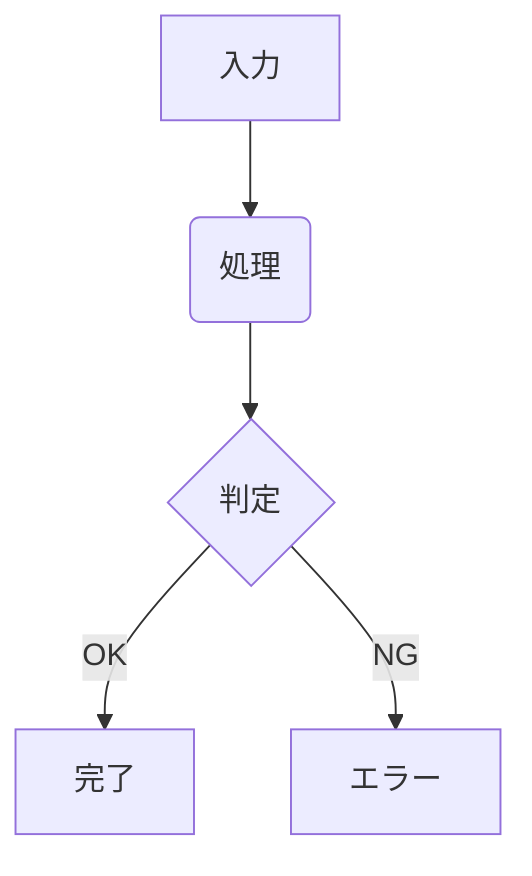

# Markdown 執筆・記法ガイド

当テックブログ（Article / Book）で記事を執筆する際に利用できる記法のリファレンスです。
標準の GitHub Flavored Markdown (GFM) に加え、当サイト独自のリッチなカスタムディレクティブや埋め込み機能をサポートしています。

---

## 目次

1. [カスタムディレクティブ（独自拡張記法）](#1-カスタムディレクティブ独自拡張記法)
   - [蛍光ペン風マーカー（`:mark`）](#蛍光ペン風マーカーmark)
   - [ファイルパス表記（`:file`）](#ファイルパス表記file)
   - [キートップ表示（`:kbd`）](#キートップ表示kbd)
   - [ピルバッジ（`:badge`）](#ピルバッジbadge)
   - [伏せ字・ぼかし（`:spoiler`）](#伏せ字ぼかしspoiler)
   - [インラインSVGアイコン（`:icon`）](#インラインsvgアイコンicon)
   - [ルビ・ふりがな（`:ruby`）](#ルビふりがなruby)
   - [チュートリアル用ステップ表示（`:::steps`）](#チュートリアル用ステップ表示steps)
   - [折りたたみアコーディオン（`:::details`）](#折りたたみアコーディオンdetails)
2. [コロン表記の安全性について](#2-コロン表記の安全性について)
3. [GFM コールアウト（アラート記法）](#3-gfm-コールアウトアラート記法)
4. [その他のサポート機能](#4-その他のサポート機能)
   - [リンクカード](#リンクカード)
   - [Mermaid ダイアグラム](#mermaid-ダイアグラム)
   - [数式（MathJax）](#数式mathjax)

---

## 1. カスタムディレクティブ（独自拡張記法）

インラインまたはブロック単位で、HTMLタグを直書きせずにリッチなUIを挿入できる構文です。

### 蛍光ペン風マーカー（`:mark`）

文字の下部にアンダーライングラデーションを敷く、定番の蛍光ペンハイライトです。OKLCH色空間による知覚均一な明度設計により、どの色相を選んでも文字の読みやすさが揃います。ダークモード時でも白文字のコントラスト（L差 0.35以上）が維持されるよう、テーマに応じて発色と下線位置を自動調整しています。

```markdown
これは :mark[重要なポイント] です。
重大な警告は :mark[ピンクのマーカー]{color="pink"} で強調します。
成功やメリットは :mark[グリーンのマーカー]{color="green"} が使えます。
```

- **属性 `color`**: `yellow`（デフォルト）, `pink`, `green`, `blue`, `orange`, `purple`

### ファイルパス表記（`:file`）

技術記事で頻出するファイルパスや設定ファイル名を、通常のインラインコードと差別化して視覚的に伝えます。小さなファイルアイコンが先頭に自動付与されます。

```markdown
設定ファイル :file[astro.config.mjs] を編集します。
スタイル定義は :file[src/styles/articledetail.css] に記述されています。
```

### キートップ表示（`:kbd`）

操作マニュアルやショートカットキーの案内に使います。境界線とシャドウがついた立体的なキートップ風スタイルが適用されます。

```markdown
保存する際は :kbd[Ctrl + S] （Macは :kbd[Cmd + S] ）を押します。
コマンドパレットは :kbd[Cmd + Shift + P] です。
```

### ピルバッジ（`:badge`）

ステータスやバージョン、カテゴリの強調に使える角丸バッジです。

```markdown
最新版は :badge[v1.4.0] です。
新機能: :badge[NEW]{variant="success"}
開発中: :badge[BETA]{variant="warning"}
非推奨: :badge[DEPRECATED]{variant="danger"}
ドキュメント: :badge[DOCS]{variant="info"}
```

- **属性 `variant`**: `default`, `success`（green）, `warning`（yellow/amber）, `danger`（red/error）, `info`（blue）, `purple`

### 伏せ字・ぼかし（`:spoiler`）

クイズの答えやネタバレ、秘密情報をぼかして隠せます。マウスホバーまたはタップでふわりと解除されて読めるようになります。

```markdown
真犯人はライブラリではなく :spoiler[ケアレスミスによる無限ループ] でした。
暗証番号のヒント: :spoiler[誕生日を逆から読んだ数字]
```

### インラインSVGアイコン（`:icon`）

文中にSVGアイコンを直接埋め込めます。マーキーセクションと同様に、3,000種類以上のブランド・技術スタックアイコン（Simple Icons）や、UIアイコン（Tabler Icons）の名前を自動探索してインラインSVGを描画します。

```markdown
:icon[check] テストがすべて通過しました。
:icon[star] おすすめのライブラリです。
:icon[astro] Astro
:icon[bun] Bun
:icon[typescript] TypeScript
:icon[rust] Rust
:icon[tailwind] Tailwind CSS
:icon[github] GitHub
```

- **対応アイコン**:
  - **技術・ブランドアイコン**: Simple Icons に収録されている 3,000 種類以上（`github`, `astro`, `bun`, `react`, `typescript`, `rust`, `tailwind`, `zenn`, `cloudflare`, `docker`, `python` 等）
  - **Twitter / X ロゴ**: `:icon[twitter]` または `:icon[brand-x]`, `:icon[x-twitter]`
  - **UIアイコン**: Tabler Icons に収録されている汎用アイコン（`:icon[check]` チェック、`:icon[x]` バツ印、`:icon[star]` スター、`:icon[copy]` コピー、`:icon[external]` 外部リンク 等）
  ※ `:icon[x]` はバツ印（×）として動作します。Twitter/Xのロゴを表示したい場合は `:icon[twitter]` を指定してください。

### ルビ・ふりがな（`:ruby`）

専門用語や難読漢字に HTML の `<ruby>` タグを用いたアクセシブルなふりがなを振ることができます。

```markdown
OKLCHは :ruby[知覚均一]{rt="ちかくきんいつ"} な色空間です。
この仕様には :ruby[脆弱性]{rt="ぜいじゃくせい"} の懸念があります。
```

### チュートリアル用ステップ表示（`:::steps`）

`:::steps` で囲むと、内側の見出し（`###`）に **①, ②, ③ の番号付き丸バッジと垂直ライン** が自動で付き、Zenn や公式ドキュメントのような洗練されたステップ手順レイアウトになります。

````markdown
:::steps
### パッケージのインストール
必要な依存パッケージを追加します。
```bash
bun add @astrojs/check
```

### 設定ファイルの更新
:file[astro.config.mjs] にプラグインを追加します。

### サーバーの起動
```bash
bun run dev
```
:::
````

### 折りたたみアコーディオン（`:::details`）

長いソースコードや補足解説をスマートに折りたためます。

````markdown
:::details[設定ファイルの全文を見る]
```json
{
  "name": "example",
  "version": "1.0.0"
}
```
:::
````

---

## 2. コロン表記の安全性について

当サイトのディレクティブパーサーは**ホワイトリスト方式**を採用しています。

そのため、以下のような日常的なコロンを含む文章を書いても、**ディレクティブと誤認されて文字が消えたり不自然に改行されることは一切ありません**。エスケープ処理を意識せずそのまま自然に記述できます。

- コントラスト比: `4.5:1`, `16.24:1`, `3:1`
- 時刻: `14:30`, `09:00`
- 比率・スコア: `3:2`, `1:1`

---

## 3. GFM コールアウト（アラート記法）

重要事項やTipsの伝達には、GitHub 標準の GFM Callout 構文を使用してください（`remark-github-alerts` により自動スタイリングされます）。

```markdown
> [!NOTE]
> 補足情報や背景の説明です。

> [!TIP]
> 役立つヒントや効率的なテクニックです。

> [!IMPORTANT]
> 読者が必ず確認すべき重要情報です。

> [!WARNING]
> 注意や警告を促す内容です。

> [!CAUTION]
> 破壊的な操作やセキュリティリスクに関する警告です。
```

---

## 4. その他のサポート機能

### リンクカード

URL を単独の段落（行）として記述すると、自動的に OGP 情報を取得してリッチなリンクカードに変換されます。

```markdown
https://astro.build/
```

### Mermaid ダイアグラム

コードブロックの言語に `mermaid` を指定することで、フローチャートやシーケンス図を SSR で高速描画できます。

````markdown

````

### 数式（MathJax）

インライン数式は `$ ... $`、ブロック数式は `$$ ... $$` で記述できます。

```markdown
アインシュタインの式は $E = mc^2$ です。

$$
\int_{-\infty}^{\infty} e^{-x^2} dx = \sqrt{\pi}
$$
```
