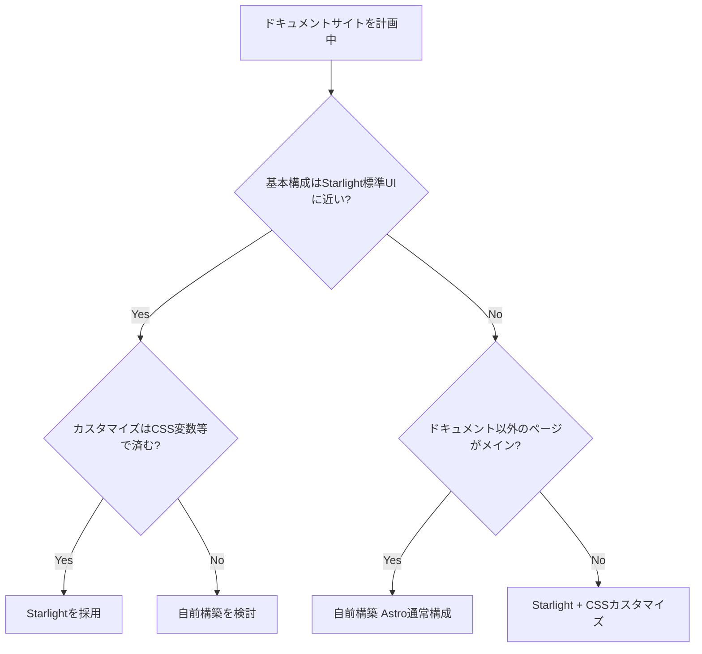

## この章で学ぶこと

技術ドキュメント、プロダクトマニュアル、APIリファレンスなどのドキュメントサイトを構築する方法を学びます。Astro公式が提供する **Starlight** フレームワークを活用し、効率的にドキュメントサイトを構築します。

## Starlightとは

[Starlight](https://starlight.astro.build/) は、Astro上に構築された **ドキュメントサイト専用のフレームワーク** です。Astro公式のドキュメントサイト自体もStarlightで作られています。

Starlightが提供する主な機能:

- **サイドバーナビゲーション** — 自動生成 or 手動設定
- **全文検索** — Pagefindによるクライアントサイド検索（設定不要）
- **多言語対応** — i18nの仕組みを標準搭載
- **ダークモード** — 自動切り替え対応
- **アクセシビリティ** — WAI-ARIA準拠
- **SEO最適化** — メタタグ、OGP、サイトマップの自動生成

## Starlightプロジェクトの作成

新規にStarlightプロジェクトを作成する場合:

```sh
npm create astro@latest -- --template starlight
```

既存のAstroプロジェクトにStarlightを追加する場合:

```sh
npx astro add starlight
```

## 基本的な設定

```js
// astro.config.mjs
import { defineConfig } from 'astro/config';
import starlight from '@astrojs/starlight';

export default defineConfig({
  integrations: [
    starlight({
      title: 'My Docs',
      social: {
        github: 'https://github.com/your-username/your-repo',
      },
      sidebar: [
        {
          label: 'ガイド',
          items: [
            { label: 'はじめに', slug: 'guides/getting-started' },
            { label: 'インストール', slug: 'guides/installation' },
            { label: '基本的な使い方', slug: 'guides/basic-usage' },
          ],
        },
        {
          label: 'リファレンス',
          autogenerate: { directory: 'reference' },
        },
      ],
    }),
  ],
});
```

`sidebar` の設定で、ドキュメントのナビゲーション構造を定義します。手動で項目を指定する方法と、`autogenerate` でディレクトリから自動生成する方法を組み合わせられます。

## ドキュメントの作成

Starlightのドキュメントは `src/content/docs/` ディレクトリに Markdown / MDX ファイルとして作成します。

```
src/content/docs/
├── index.mdx                    # トップページ
├── guides/
│   ├── getting-started.md       # /guides/getting-started
│   ├── installation.md          # /guides/installation
│   └── basic-usage.md           # /guides/basic-usage
└── reference/
    ├── api.md                   # /reference/api
    └── config.md                # /reference/config
```

```md
---
title: はじめに
description: プロジェクトのセットアップ方法を解説します。
---

## 概要

このガイドでは、プロジェクトのセットアップ手順を解説します。

## 前提条件

- Node.js v22以上
- npm v10以上

## インストール

以下のコマンドでインストールできます:

```sh
npm install my-package
```
```

frontmatterの `title` と `description` は、ページタイトルとSEOのメタタグに自動的に使用されます。

## カスタマイズ

### テーマカラーの変更

```js
// astro.config.mjs
starlight({
  title: 'My Docs',
  customCss: ['./src/styles/custom.css'],
})
```

```css
/* src/styles/custom.css */
:root {
  --sl-color-accent-low: #1e1b4b;
  --sl-color-accent: #6366f1;
  --sl-color-accent-high: #c7d2fe;
}
```

### コンポーネントのオーバーライド

Starlightは主要なUIコンポーネントのオーバーライドに対応しています。

```js
starlight({
  components: {
    Header: './src/components/CustomHeader.astro',
    Footer: './src/components/CustomFooter.astro',
  },
})
```

## Starlight vs 自前構築の判断基準

Starlightを使うべきか、自分でドキュメントサイトを構築すべきかの判断基準を示します。

### Starlightを使うべきケース ✅

- **標準的なドキュメントサイト** — サイドバー + コンテンツ + 検索の構成
- **早く公開したい** — 設定だけで動く
- **多言語対応が必要** — i18nが標準搭載
- **メンテナンスコストを抑えたい** — Starlightのアップデートで改善される

### 自前構築を検討すべきケース ❌

- **デザインが大きく異なる** — Starlightの見た目から大幅に変えたい
- **ドキュメント以外のセクションが多い** — ブログ、ダッシュボード等が中心
- **独自の検索・ナビゲーション** — Starlightの構造に収まらない要件

### 判断フロー



## ドキュメントサイトの情報設計

ドキュメントの構造設計（IA: Information Architecture）のベストプラクティスを解説します。

### 推奨する4分類構造

優れたドキュメントサイトは、以下の4つのカテゴリでコンテンツを整理しています。

| カテゴリ | 目的 | 例 |
|---|---|---|
| **チュートリアル** | 手を動かしながら学ぶ | 「最初のプロジェクトを作る」 |
| **ガイド** | 特定のタスクを達成する方法 | 「認証を追加する」「デプロイする」 |
| **リファレンス** | 正確な仕様・APIの詳細 | 「設定オプション一覧」「API仕様」 |
| **解説** | 概念や設計思想の説明 | 「なぜこのアーキテクチャを採用したか」 |

この分類は [Diátaxis Framework](https://diataxis.fr/) に基づいています。公式ドキュメントでは紹介されていませんが、多くの優れた技術ドキュメント（Django、NumPy等）がこの構造を採用しています。

### サイドバーの設計原則

1. **最も重要なページを上に** — 「はじめに」「インストール」は常に最上部
2. **階層は2〜3段階まで** — 深すぎる階層は迷いの原因
3. **カテゴリ名は行動指向に** — 「設定」ではなく「プロジェクトを設定する」
4. **ページ数は1カテゴリ5〜10件** — 多すぎる場合はサブカテゴリに分割

## まとめ

この章で学んだことを振り返ります。

1. **Starlight** — Astro公式のドキュメントサイトフレームワーク
2. **サイドバー設定** — 手動指定と自動生成の組み合わせ
3. **カスタマイズ** — CSS変数によるテーマ変更、コンポーネントオーバーライド
4. **情報設計** — Diátaxis Frameworkに基づく4分類構造

次の章では、構築したサイトを公開するためのデプロイ方法を学びます。
