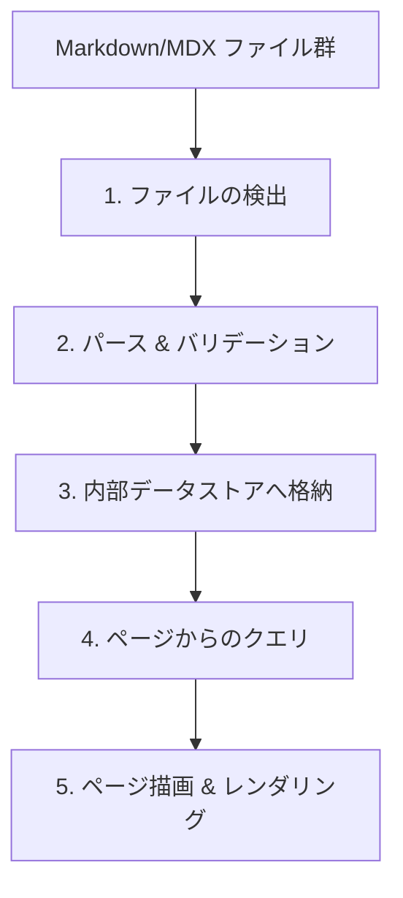

## この章で学ぶこと

ブログやドキュメントサイトでは、多数のMarkdownファイルを管理する必要があります。Content Collectionsは、これらのコンテンツを**型安全に管理**するためのAstro標準の仕組みです。この章では、Content Collectionsの設定からデータの取得・表示までを学びます。

## Content Collectionsとは

Content Collectionsは、`src/content/` ディレクトリ内のコンテンツを**スキーマ付きで管理**する機能です。

従来の方法（`src/pages/` にMarkdownを直接置く方法）では、以下の問題がありました。

- frontmatterに何を書くべきかのルールがない
- 必須フィールドの漏れに気づけない
- 日付の形式が統一されていないかもしれない
- 型補完が効かない

Content Collectionsは、**Zodスキーマでfrontmatterの型を定義し、ビルド時にバリデーション**を行うことでこれらの問題を解決します。

## 基本的なセットアップ

### 1. コンテンツディレクトリの作成

```
src/
├── content/
│   ├── blog/              # "blog" コレクション
│   │   ├── first-post.md
│   │   ├── second-post.md
│   │   └── third-post.md
│   └── config.ts          # スキーマ定義
└── pages/
```

### 2. スキーマの定義

`src/content.config.ts`（プロジェクトルート付近に配置）でコレクションのスキーマを定義します。

```ts
// src/content.config.ts
import { defineCollection, z } from 'astro:content';
import { glob } from 'astro/loaders';

const blog = defineCollection({
  loader: glob({ pattern: '**/*.{md,mdx}', base: './src/content/blog' }),
  schema: z.object({
    title: z.string(),
    description: z.string(),
    pubDate: z.coerce.date(),
    updatedDate: z.coerce.date().optional(),
    tags: z.array(z.string()).default([]),
    draft: z.boolean().default(false),
  }),
});

export const collections = { blog };
```

ここで使っている `z`（Zod）は、Astroにバンドルされているバリデーションライブラリです。各フィールドの型、必須/任意、デフォルト値などを宣言的に定義できます。

### 3. コンテンツの作成

```md
---
title: Astroを使ってブログを作った話
description: Astroの良さと、実際に使ってみた感想をまとめました。
pubDate: 2026-04-15
tags: ["astro", "web開発"]
---

## はじめに

Astroを使ってブログサイトを構築してみました。
結論から言うと、コンテンツ重視のサイトには最適でした。

## 良かった点

- ビルドが速い
- Markdownがそのまま使える
- 不要なJavaScriptが送られない
```

frontmatterに `title` を書き忘れたり、`pubDate` の形式が間違っていたりすると、**ビルド時にエラーとして検出** されます。これがContent Collectionsの最大の利点です。

## コンテンツの取得

### コレクション全体を取得

```astro
---
// src/pages/blog/index.astro
import { getCollection } from 'astro:content';
import BaseLayout from '../../layouts/BaseLayout.astro';

// 下書きを除外し、日付で降順ソート
const posts = (await getCollection('blog'))
  .filter((post) => !post.data.draft)
  .sort((a, b) => b.data.pubDate.valueOf() - a.data.pubDate.valueOf());
---

<BaseLayout title="ブログ">
  <h1>ブログ記事一覧</h1>
  <ul>
    {posts.map((post) => (
      <li>
        <a href={`/blog/${post.id}`}>
          <h2>{post.data.title}</h2>
          <time datetime={post.data.pubDate.toISOString()}>
            {post.data.pubDate.toLocaleDateString('ja-JP')}
          </time>
          <p>{post.data.description}</p>
        </a>
      </li>
    ))}
  </ul>
</BaseLayout>
```

`getCollection()` はコレクション内のすべてのエントリを返します。返り値の `post.data` にはスキーマに定義した型が付いているため、**エディタの補完が完全に効きます**。

### 個別のエントリを取得

```astro
---
// src/pages/blog/[id].astro
import type { GetStaticPaths } from 'astro';
import { getCollection, render } from 'astro:content';
import BaseLayout from '../../layouts/BaseLayout.astro';

export const getStaticPaths: GetStaticPaths = async () => {
  const posts = await getCollection('blog');
  return posts.map((post) => ({
    params: { id: post.id },
    props: { post },
  }));
};

const { post } = Astro.props;
const { Content } = await render(post);
---

<BaseLayout title={post.data.title}>
  <article>
    <h1>{post.data.title}</h1>
    <time datetime={post.data.pubDate.toISOString()}>
      {post.data.pubDate.toLocaleDateString('ja-JP')}
    </time>
    <Content />
  </article>
</BaseLayout>
```

`render()` はMarkdownの本文をAstroコンポーネントとして返します。`<Content />` として配置するだけで、Markdownが描画されます。

## Content Layerの仕組み

Content Collectionsが内部でどのように動作しているか、その仕組みを解説します。

Content CollectionsはAstro 5で安定化した **Content Layer API** の上に構築されています。内部的には以下の流れで動作します。



この仕組みのポイントは、**ファイルシステムの読み取りとバリデーションがビルド時に1回だけ行われる**ことです。クエリ時にはすでにパース済みのデータを参照するだけなので、高速に動作します。

また、Content Layer APIは `loader` が抽象化されているため、ファイルシステム以外のデータソース（API、CMS、データベースなど）からもコンテンツを取得できるようになっています。`glob()` はそのうちの1つのローダーに過ぎません。

## 環境変数の管理

Content Collections自体では環境変数は使いませんが、外部APIからコンテンツを取得する場合や、デプロイ設定で必要になることがあります。

AstroはViteベースのため、`.env` ファイルで環境変数を管理できます。

```sh
# .env
PUBLIC_SITE_TITLE="My Astro Blog"
SECRET_API_KEY="xxxxxxxxxxxxxxxx"
```

- `PUBLIC_` プレフィックスを付けた変数はクライアント側でも参照可能
- プレフィックスなしの変数はサーバー側（フロントマタースクリプト）でのみ参照可能

```astro
---
// サーバー側でのみ参照可能
const apiKey = import.meta.env.SECRET_API_KEY;

// クライアント側でも参照可能
const siteTitle = import.meta.env.PUBLIC_SITE_TITLE;
---
```

`.env` ファイルには機密情報を含むことが多いため、`.gitignore` に追加してGitの管理対象から外しておきましょう。

## まとめ

この章で学んだことを振り返ります。

1. **Content Collections** — Zodスキーマでfrontmatterを型安全に管理
2. **`content.config.ts`** — コレクションのスキーマとローダーを定義
3. **`getCollection()` / `render()`** — コンテンツの取得と描画
4. **Content Layer API** — 内部アーキテクチャと拡張性

次の章では、これまでの知識を総動員して、実際のブログサイトを構築します。
