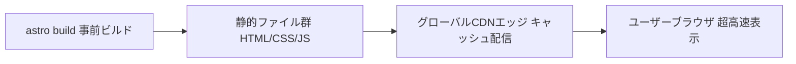
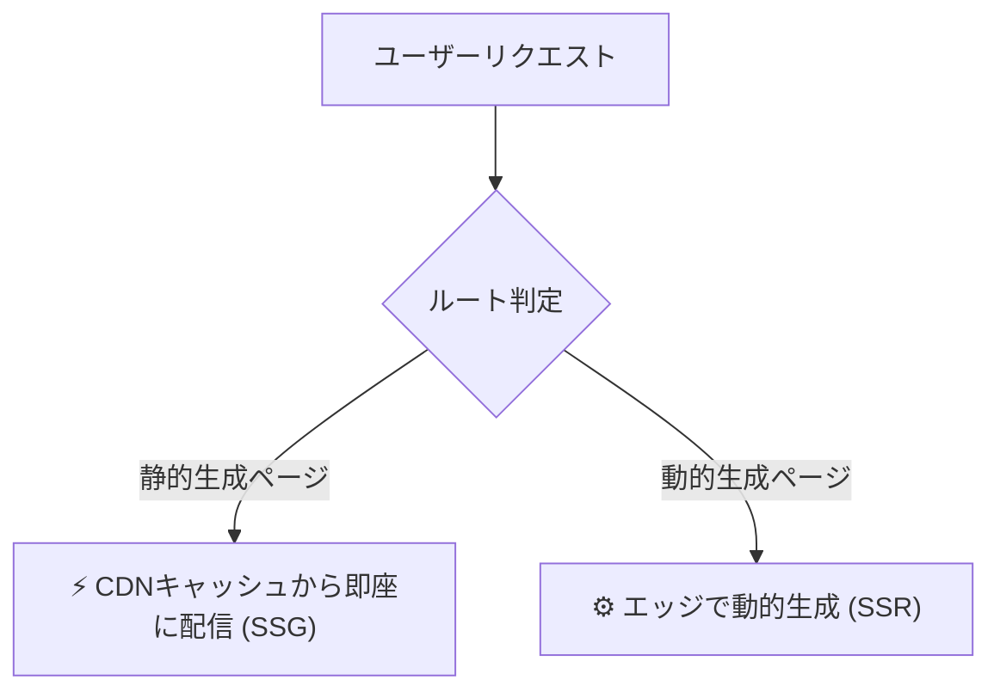

## この章で学ぶこと

構築したAstroサイトを実際にインターネット上に公開する方法を学びます。SSG（静的サイト）とSSR（サーバーサイドレンダリング）の両方のデプロイ方法を、主要なホスティングサービスごとに解説します。

## ビルド

デプロイの前に、まずサイトをビルドします。

```sh
npm run build
```

SSGモード（デフォルト）の場合、`dist/` ディレクトリに静的なHTML/CSS/JSファイルが生成されます。このディレクトリの中身をそのままWebサーバーにアップロードすれば、サイトが公開できます。

ビルド結果をローカルでプレビューするには:

```sh
npm run preview
```

## SSGとSSRの選択

デプロイ方法は、サイトの出力モードによって異なります。

```js
// astro.config.mjs
export default defineConfig({
  // SSG（静的生成）— デフォルト
  output: 'static',

  // SSR（サーバーサイドレンダリング）
  // output: 'server',
});
```

| | SSG (`output: 'static'`) | SSR (`output: 'server'`) |
|---|---|---|
| **ビルド成果物** | 静的ファイル（HTML/CSS/JS） | サーバーアプリケーション |
| **必要なもの** | 静的ホスティングのみ | Node.jsサーバー or エッジランタイム |
| **デプロイ先** | どこでもOK | アダプター対応のプラットフォーム |
| **適したケース** | ブログ、ドキュメント、LP | 認証、動的コンテンツ |

多くのコンテンツサイトでは **SSGで十分** です。

## Cloudflare Workers へのデプロイ

Cloudflare Workersは、世界中のエッジネットワーク上でコードを実行できるサーバーレスプラットフォームです。SSGサイトの配信はもちろん、SSRモードのAstroサイトもエッジで実行できます。

> [!NOTE]
> Cloudflare Pagesも存在しますが、現在ではWorkersがPagesの機能を完全に包含しており、Cloudflare自身もWorkersへの統合を推進しています。

### SSGサイトのデプロイ

#### 1. Wranglerのインストール

```sh
npm install -D wrangler
```

#### 2. `wrangler.jsonc` の作成

```jsonc
// wrangler.jsonc
{
  "name": "my-astro-site",
  "compatibility_date": "2026-08-01",
  "assets": {
    "directory": "./dist"
  }
}
```

#### 3. デプロイ

```sh
npm run build
npx wrangler deploy
```

これだけでCloudflareのグローバルCDNにサイトが配信されます。

### SSRサイトのデプロイ

SSRを使う場合は、Cloudflareアダプターを追加します。

```sh
npx astro add cloudflare
```

```js
// astro.config.mjs
import { defineConfig } from 'astro/config';
import cloudflare from '@astrojs/cloudflare';

export default defineConfig({
  output: 'server',
  adapter: cloudflare(),
});
```

`wrangler.jsonc` にもエントリポイントを追加します:

```jsonc
{
  "name": "my-astro-site",
  "main": "./dist/_worker.js",
  "compatibility_date": "2026-08-01",
  "assets": {
    "directory": "./dist/client"
  }
}
```

ビルド・デプロイ手順はSSGと同じです。

```sh
npm run build
npx wrangler deploy
```

### GitHubとの連携

Cloudflareダッシュボードから GitHub リポジトリを接続すると、`main` ブランチへのプッシュ時に自動デプロイが行われます。手動で `wrangler deploy` を実行する必要がなくなります。

## Vercel へのデプロイ

### SSGサイト

Vercelは追加設定なしでAstroのSSGサイトをデプロイできます。

1. [Vercel](https://vercel.com/) にGitHubリポジトリを接続
2. Frameworkに「Astro」を選択
3. デプロイ

以上で完了です。以降はGitHubにプッシュするたびに自動デプロイされます。

### SSRサイト

```sh
npx astro add vercel
```

```js
// astro.config.mjs
import { defineConfig } from 'astro/config';
import vercel from '@astrojs/vercel';

export default defineConfig({
  output: 'server',
  adapter: vercel(),
});
```

## Netlify へのデプロイ

### SSGサイト

1. [Netlify](https://www.netlify.com/) にGitHubリポジトリを接続
2. Build command: `npm run build`
3. Publish directory: `dist`

### SSRサイト

```sh
npx astro add netlify
```

```js
// astro.config.mjs
import { defineConfig } from 'astro/config';
import netlify from '@astrojs/netlify';

export default defineConfig({
  output: 'server',
  adapter: netlify(),
});
```

## ホスティングサービス比較

主要なホスティングサービスを実践的に比較します。

| 特性 | Cloudflare Workers | Vercel | Netlify |
|---|---|---|---|
| **無料枠** | 10万リクエスト/日 | 100GB帯域/月 | 100GB帯域/月 |
| **SSG対応** | ◎ | ◎ | ◎ |
| **SSR対応** | ◎（エッジ実行） | ◎（エッジ/サーバーレス） | ◎（サーバーレス） |
| **エッジ実行** | ◎（全拠点） | ○（エッジ関数） | ○（エッジ関数） |
| **ビルド時間（無料枠）** | ローカルビルド | 6000分/月 | 300分/月 |
| **独自ドメイン** | ◎（無料） | ◎（無料） | ◎（無料） |
| **SSL** | ◎（自動） | ◎（自動） | ◎（自動） |
| **Git連携** | ◎ | ◎ | ◎ |
| **Web Analytics** | ◎（無料） | △（有料） | △（有料） |

### 選び方の指針

- **とにかく速くて安い** → Cloudflare Workers（無料枠が最も太く、エッジ実行がデフォルト）
- **DXを重視** → Vercel（プレビューデプロイ、速度インサイトが優秀）
- **フォーム処理が必要** → Netlify（Netlify Formsが便利）

## デプロイ戦略の使い分け

プロジェクトの要件に応じたデプロイ戦略の選び方を解説します。

### SSG + CDN（推奨）



- **最速の表示速度** — ファイルがCDNのエッジにキャッシュされる
- **最安** — サーバーが不要
- **適したケース** — ブログ、ドキュメント、LP、ポートフォリオ

### SSR + エッジ


- **動的なコンテンツ対応** — リクエストごとに異なるHTMLを返せる
- **高速** — エッジ（ユーザーに近い場所）で実行
- **適したケース** — 認証付きサイト、パーソナライズされたコンテンツ

### ハイブリッド（SSR + 一部ページをプリレンダリング）



```astro
---
// このページだけビルド時に静的生成する
export const prerender = true;
---
```

- **SSGとSSRのいいとこ取り** — 静的にできるページはCDN配信、動的が必要なページだけSSR
- **適したケース** — ブログ（SSG）+ 管理画面（SSR）を1つのプロジェクトで管理

多くのコンテンツサイトでは**SSG + CDN**で始めるのが最善です。SSRが必要になったら、`output: 'server'` に切り替えて `export const prerender = true` で既存ページを保護するアプローチが、移行コストが最も低いです。

## まとめ

この章で学んだことを振り返ります。

1. **`npm run build`** で静的ファイルまたはサーバーアプリケーションを生成
2. **Cloudflare Workers** — エッジ実行が強み。SSG/SSR両対応
3. **Vercel / Netlify** — Git連携で簡単にデプロイ
4. **デプロイ戦略** — SSG + CDN が最速・最安。必要に応じてSSRに移行

---

お疲れさまでした！全12章を通して、Astroの設計思想から実際のサイト構築、デプロイまでを一通り学びました。

ここから先は、公式ドキュメントの[ガイド](https://docs.astro.build/)や[インテグレーション一覧](https://astro.build/integrations/)を参照しながら、自分のプロジェクトをカスタマイズしていってください。
