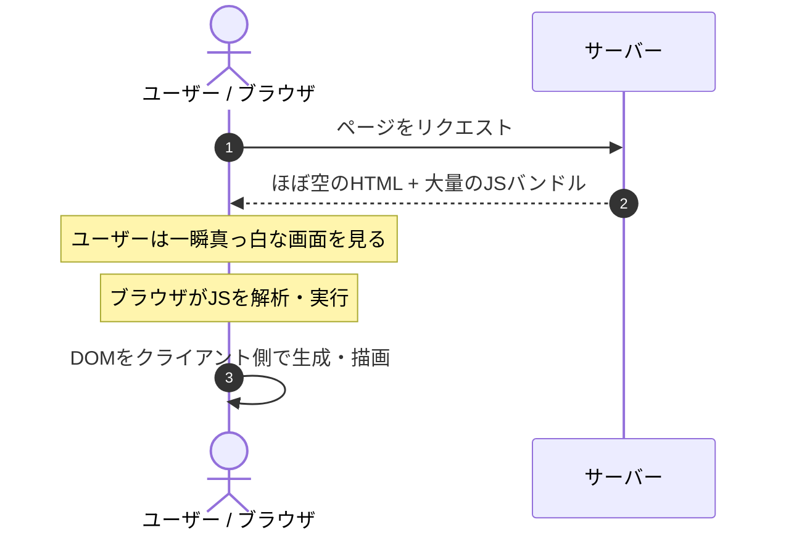
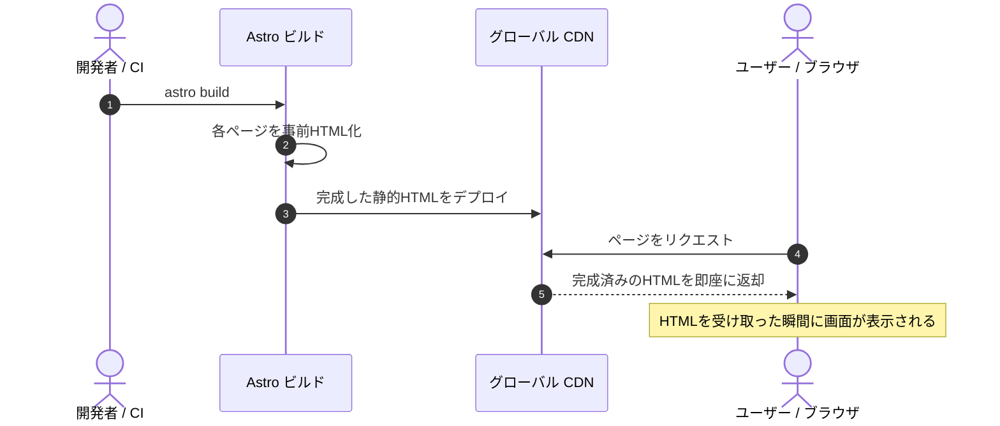
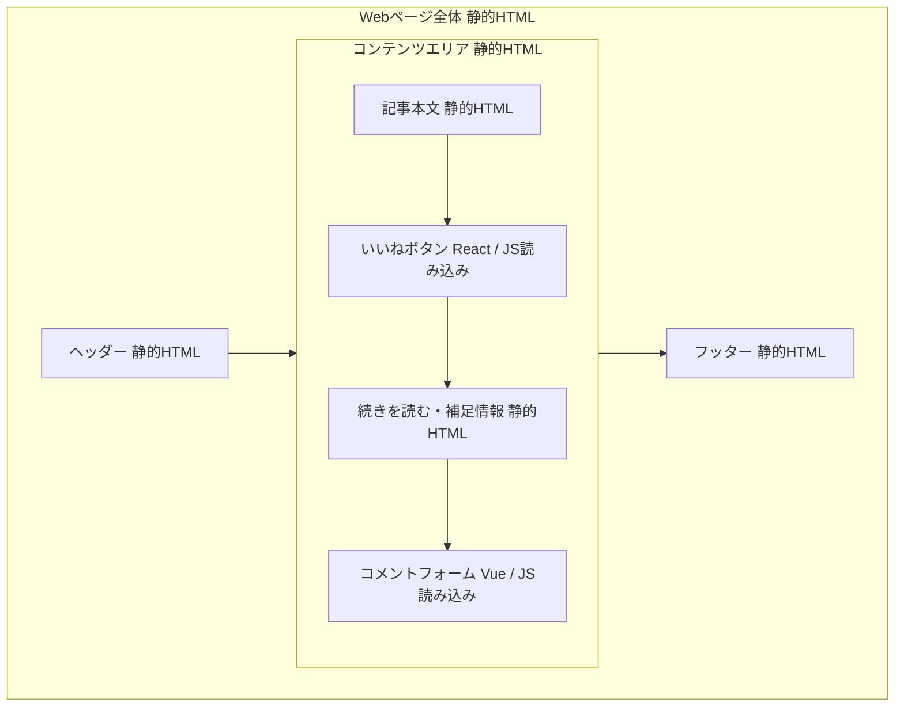

## この章で学ぶこと

Astroのコードを書き始める前に、「Astroがどのようにして高速なWebサイトを実現しているのか」を理解しましょう。仕組みを知っておくことで、後の章でコードを書くときに「なぜこう書くのか」が自然と理解できるようになります。

## ビルド時レンダリング（SSG）の仕組み

Astroはデフォルトで **静的サイトジェネレーター（SSG: Static Site Generator）** として動作します。

通常のReactアプリ（SPA）とAstro（SSG）の動作フローを比較してみましょう。

### SPA（React等）の場合



### Astro（SSG）の場合



ポイントは、**ページの描画に必要な処理はすべてビルド時に終わっている**ということです。ブラウザはHTMLを受け取るだけで即座にページを表示できるため、表示速度が格段に速くなります。

## 「ゼロJS、デフォルト」の意味

Astroで作ったページは、特に何も指定しなければ **JavaScriptを1バイトもクライアントに送りません**。

たとえば以下のような `.astro` ファイルを書いた場合：

```astro
---
const greeting = "こんにちは！";
---

<h1>{greeting}</h1>
<p>Astroで作ったページです。</p>
```

ビルドすると、出力されるのは純粋なHTMLだけです。

```html
<h1>こんにちは！</h1>
<p>Astroで作ったページです。</p>
```

フロントマター内の `const greeting = "こんにちは！"` はビルド時に解決され、出力には含まれません。ブラウザには「結果」だけが届きます。

## Islands Architecture（アイランドアーキテクチャ）

### Webフレームワークの進化の歴史

Islands Architectureを理解するために、Webフレームワークの歴史を簡単に振り返りましょう。

**第1世代：サーバーサイドレンダリング（2000年代）**

PHP、Ruby on Rails、Djangoなどが主流でした。サーバーでHTMLを生成してブラウザに送るシンプルな仕組みです。ページ遷移のたびにサーバーに問い合わせが発生し、全画面が再読み込みされていました。

**第2世代：SPA — Single Page Application（2010年代前半〜）**

Angular、React、Vueの登場により、ブラウザ側でJavaScriptがすべてのUI描画を担うようになりました。ページ遷移が高速になり、リッチなユーザー体験が可能になった一方で、**初期ロード時に大量のJavaScriptをダウンロードする必要がある**という問題が生まれました。

- 初期表示まで3〜5秒かかる（JS解析・実行待ち）
- SEOに不利（検索エンジンがJSを実行する必要がある）
- 低スペック端末で重い

**第3世代：SSR + Hydration（2010年代後半〜）**

Next.js、Nuxtが登場し、サーバーでHTMLを事前生成（SSR）した後、ブラウザ側でJavaScriptが「引き継ぎ」を行う **Hydration（ハイドレーション）** という手法が主流になりました。

初期表示は速くなりましたが、ページ全体をHydrationするためにやはり大量のJavaScriptが送られるという本質的な問題は残っていました。

**第4世代：Islands Architecture（2020年代〜）**

ここでAstroの出番です。「ページ全体をHydrationする必要があるのか？」という問いに対する答えが **Islands Architecture** です。

### Islandsの考え方

ページの大部分は静的なHTMLとして送り、**インタラクティブな操作が必要な箇所だけ**を独立した「島（Island）」として個別にHydrationします。



このアーキテクチャの利点は明確です。

- ページ全体のうち、本当にJSが必要な部分にだけJSを送る
- 各Islandは独立してロードされるため、1つのIslandが遅くてもページ全体の表示は影響を受けない
- 結果として、転送量が劇的に減り、表示速度が大幅に向上する

## ブラウザに送られるものを実際に見てみる

Astro製サイトのJS転送量がどれだけ少ないかは、ブラウザのDevToolsで実際に確認できます。

1. Astro公式サイト（https://astro.build/）をChromeで開く
2. `F12` でDevToolsを開き、「Network」タブを選択
3. `Ctrl+Shift+R`（ハードリロード）でページを再読み込み
4. 下部の「transferred」の数値と、フィルタで「JS」を選択したときの数値を確認

一般的なSPAと比較すると、JavaScript転送量に大きな差があることがわかるはずです。

とはいえ、Astro公式サイト自体にもインタラクティブな要素があるため、ゼロにはなりません。Islands Architectureでは、**必要なところにだけJSを送る**ことが重要なのであって、JSを完全に排除することが目的ではありません。

## SSGとSSRの使い分け

Astroは **SSG（静的生成）** がデフォルトですが、**SSR（サーバーサイドレンダリング）** にも対応しています。

| | SSG（静的生成） | SSR（サーバー実行） |
|---|---|---|
| **いつHTMLが生成される？** | ビルド時（1回だけ） | リクエストごと（毎回） |
| **適したケース** | ブログ、ドキュメント、LP | ユーザー認証付きページ、動的コンテンツ |
| **表示速度** | 最速（CDNから配信） | 速い（エッジ実行なら高速） |
| **設定** | `output: 'static'`（デフォルト） | `output: 'server'` |

多くのコンテンツサイトでは **SSGで十分** です。SSRが必要になるのは、ログイン機能やユーザーごとに異なるコンテンツを表示する必要がある場合です。

また、SSRモードでも個別のページに `export const prerender = true` を指定すれば、そのページだけをビルド時に静的生成できます。つまり、**SSGとSSRを同一プロジェクト内でページごとに使い分け**られます。

## まとめ

この章で理解しておくべきポイントは以下の3つです。

1. **Astroはデフォルトで静的HTML**を生成し、JavaScriptを送らない
2. **Islands Architecture**により、インタラクティブな部分だけにJSを送る
3. **SSGとSSR**をプロジェクトの要件に応じて使い分けられる

次の章では、実際にAstroの環境を構築して、最初のプロジェクトを作成します。
