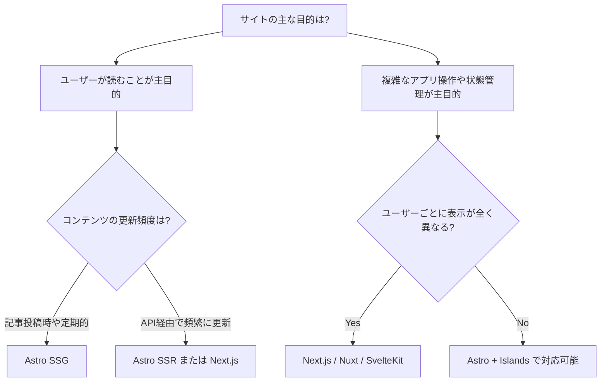

## この本のゴール

この本を読み終えるころには、以下のことができるようになります。

- **Astroの設計思想を理解し**、プロジェクトに適したフレームワークかどうかを判断できる
- **ブログサイト**をゼロから構築し、公開できる
- **ドキュメントサイト**を構築し、公開できる
- パフォーマンスを意識したWebサイト設計ができる

それでは、まず「なぜAstroなのか」という問いから始めましょう。

## Astroとは

[Astro](https://astro.build/) は、**コンテンツ重視のWebサイト**を構築するために設計されたWebフレームワークです。

ブログ、ドキュメントサイト、ポートフォリオ、コーポレートサイトなど、「コンテンツを読んでもらうこと」が主目的のサイトに特化しています。

Astroの最大の特徴は、**デフォルトではJavaScriptをクライアントに一切送らない**ことです。ページはビルド時にHTMLとして生成され、必要な箇所だけを「アイランド（島）」としてインタラクティブにできます。

## 「コンテンツ重視」とはどういうことか

Webフレームワークは大きく2つの方向性に分かれます。

| | コンテンツ重視 | アプリケーション重視 |
|---|---|---|
| **主な用途** | ブログ、ドキュメント、LP、コーポレートサイト | ダッシュボード、SNS、チャットアプリ、SaaS |
| **ページの性質** | 多くのユーザーに同じ内容を表示 | ユーザーごとに異なる内容を表示 |
| **必要なJS量** | 少ない（ほぼ読むだけ） | 多い（リアルタイム更新、状態管理） |
| **更新頻度** | 記事投稿時 | リアルタイム |
| **代表的なFW** | Astro, Hugo, Gatsby | Next.js, Nuxt, SvelteKit |

2020年代前半、多くのWebサイトが React（Next.js）や Vue（Nuxt）で構築されるようになりました。これらはアプリケーション構築には最適ですが、ブログやドキュメントのような「読むだけ」のサイトでも大量のJavaScriptがクライアントに送られるという問題がありました。

Astroは「読者にとってほぼ静的なページなのに、なぜ数百KBのJavaScriptが必要なのか？」という問いに正面から向き合ったフレームワークです。

## あなたのプロジェクトにAstroは合うか？

### Astroが最適なケース ✅

- **ブログ・メディアサイト** — 記事コンテンツが中心で、リアルタイム更新は不要
- **ドキュメントサイト** — 技術ドキュメント、マニュアル、ガイド
- **ポートフォリオ・LP** — デザイン重視で、複雑な状態管理は不要
- **コーポレートサイト** — 会社概要、サービス紹介ページ
- **EC商品カタログ** — 商品ページが中心（カート機能は別途必要）

### Astroが向いていないケース ❌

- **ダッシュボード・管理画面** — ログイン後にリアルタイムでデータが変わるUI
- **チャットアプリ・SNS** — WebSocket等を使ったリアルタイム通信が中心
- **フォーム中心のSaaS** — 複雑な状態管理と入力バリデーションが多い
- **ゲーム・高度なインタラクション** — Canvas/WebGLを多用するアプリ

### フレームワーク選定の判断フロー

### 主要フレームワークとの比較

| 特性 | Astro | Next.js | Nuxt | SvelteKit | Gatsby |
|---|---|---|---|---|---|
| 主な用途 | コンテンツサイト | フルスタックアプリ | フルスタックアプリ | フルスタックアプリ | コンテンツサイト |
| デフォルトのJS送信量 | **ゼロ** | 多い | 多い | 少なめ | 多い |
| UIフレームワーク | 自由に選択 | React固定 | Vue固定 | Svelte固定 | React固定 |
| SSG | ◎ | ○ | ○ | ○ | ◎ |
| SSR | ○ | ◎ | ◎ | ◎ | △ |
| 学習コスト | 低い | 中〜高 | 中 | 低い | 中 |
| Markdownサポート | ◎（ネイティブ） | △（要設定） | △（要設定） | △（要設定） | ○ |

重要なのは「どれが一番優れているか」ではなく、**プロジェクトの性質に最も合っているか**です。コンテンツサイトにNext.jsを使うこともできますが、不必要な複雑さを持ち込むことになります。同様に、AstroでSaaSアプリを作ろうとすれば、本来の強みを活かせません。

## Astroの主な特徴

改めて、Astroの主な特徴を整理します。

- **ゼロJS、デフォルト** — 必要な箇所だけJSを送るため、表示速度が速い
- **コンポーネントベース** — `.astro`ファイルでHTMLとロジックを直感的に記述
- **マルチフレームワーク対応** — React・Vue・Svelte・SolidJS などを同一プロジェクト内で併用可能
- **Markdown / MDXサポート** — コンテンツをMarkdownで手軽に管理
- **ビルド時レンダリング（SSG）+ SSR対応** — 用途に応じて柔軟に選択可能
- **Content Collections** — 型安全なコンテンツ管理システムを標準搭載

## 前提

本シリーズでは以下を前提に進めていきます。

- **Node.js** v22.12.0以上（LTS推奨）
- **テキストエディタ**（VS Code推奨）
- HTML / CSS / JavaScriptの基礎知識

それでは、次の章でAstroの仕組みを詳しく見ていきましょう。
