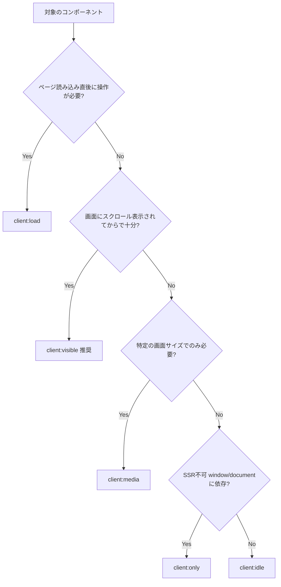

## この章で学ぶこと

第2章でIslands Architectureの概念を学びました。この章では、実際にReactやVueなどのUIフレームワークのコンポーネントをAstroに組み込み、インタラクティブなUIを追加する方法を手を動かしながら学びます。

## いつIslandsが必要か

Astroのテンプレートはサーバー側でレンダリングされるため、クライアント側でのインタラクションはそのままでは実現できません。以下のようなケースで Islands が必要になります。

- ユーザーの入力に反応するフォーム
- 状態を持つカウンター・トグル
- ドロップダウンメニューやモーダル
- 外部APIからリアルタイムにデータを取得して表示

逆に、静的なナビゲーションリンク、テキストの表示、画像の表示などには Islands は不要です。

## インテグレーションの追加

UIフレームワークを使うには、対応するインテグレーションを追加します。

```sh
# React を追加
npx astro add react

# Vue を追加
npx astro add vue

# Svelte を追加
npx astro add svelte
```

コマンドを実行すると、パッケージのインストールと `astro.config.mjs` の更新が自動的に行われます。

```js
// astro.config.mjs（React追加後）
import { defineConfig } from 'astro/config';
import react from '@astrojs/react';

export default defineConfig({
  integrations: [react()],
});
```

## Islandの基本的な使い方

### 1. UIフレームワークのコンポーネントを作成

```tsx
// src/components/Counter.tsx（React）
import { useState } from 'react';

export default function Counter() {
  const [count, setCount] = useState(0);

  return (
    <div>
      <p>カウント: {count}</p>
      <button onClick={() => setCount(count + 1)}>+1</button>
      <button onClick={() => setCount(count - 1)}>-1</button>
    </div>
  );
}
```

### 2. Astroページに `client:*` ディレクティブ付きで配置

```astro
---
// src/pages/demo.astro
import Counter from '../components/Counter';
import BaseLayout from '../layouts/BaseLayout.astro';
---

<BaseLayout title="Islandデモ">
  <h1>Astro Islands デモ</h1>
  <p>この下のカウンターはReactで動いています。</p>

  <!-- client:load でIslandとして読み込む -->
  <Counter client:load />

  <p>この段落は静的HTMLです。JavaScriptは不要です。</p>
</BaseLayout>
```

`client:load` を付けることで、このコンポーネントだけがクライアント側でHydrationされ、インタラクティブになります。**`client:*` ディレクティブを付けなかった場合、コンポーネントはサーバー側でHTMLに変換されるだけで、インタラクティブにはなりません**。

## `client:*` ディレクティブの種類

| ディレクティブ | 動作 | 使いどころ |
|---|---|---|
| `client:load` | ページ読み込み時に即座にHydration | すぐに操作が必要なUI（ヘッダーメニュー等） |
| `client:idle` | ブラウザがアイドル状態になったらHydration | 優先度の低いインタラクティブUI |
| `client:visible` | 要素が画面に表示されたらHydration | スクロールして見えるまで不要なUI |
| `client:media` | メディアクエリが一致したらHydration | 特定の画面サイズでのみ必要なUI |
| `client:only` | サーバーでは描画せず、クライアントのみで描画 | SSRできないコンポーネント（window依存等） |

### 使い分けの例

```astro
<!-- ヘッダーのハンバーガーメニュー → すぐに使える必要がある -->
<MobileMenu client:load />

<!-- サイドバーのニュースレター登録フォーム → 急ぎではない -->
<NewsletterForm client:idle />

<!-- ページ下部のコメントセクション → 見えるまで不要 -->
<Comments client:visible />

<!-- モバイルのみ表示するUI -->
<MobileOnlyWidget client:media="(max-width: 768px)" />

<!-- windowオブジェクトに依存するコンポーネント -->
<ChartComponent client:only="react" />
```

## `client:*` ディレクティブ選択フローチャート

どの `client:*` ディレクティブを使うべきか、判断フローを示します。



**迷ったら `client:visible` を選ぶのが安全です。** ほとんどのインタラクティブUIは、画面に表示されてから動けば十分です。`client:load` は本当に即座に必要なもの（ヘッダーのナビゲーション等）だけに限定しましょう。

## 複数フレームワークの混在

Astroの大きな特徴として、**1つのページに複数のUIフレームワークのコンポーネントを混在させる**ことができます。

```astro
---
import ReactCounter from '../components/Counter'; // React
import VueToggle from '../components/Toggle.vue'; // Vue
---

<h1>複数フレームワークのデモ</h1>

<ReactCounter client:visible />
<VueToggle client:visible />
```

これが可能なのは、各IslandはDOMの独立した領域として動作し、互いに干渉しないからです。

実際にこれが役立つのは、以下のようなケースです。

- チーム内にReactに詳しい人とVueに詳しい人がいる
- 既存のReactコンポーネントライブラリを流用しつつ、新規部分はSvelteで書きたい
- 特定の用途に最適なフレームワークのコンポーネントを選びたい

ただし、実務では **1〜2つのフレームワークに絞る** のが管理しやすいでしょう。

## Islands導入前後のパフォーマンス比較

`client:*` ディレクティブの違いがパフォーマンスにどう影響するか、実測する手順を紹介します。

### 計測手順

1. Chrome DevToolsの「Lighthouse」タブを開く
2. 「Mode: Navigation」「Device: Mobile」を選択
3. 「Analyze page load」を実行
4. **Performance** スコアと **Total Blocking Time (TBT)** を記録

### 試してみよう

同じページで `client:load` と `client:visible` を切り替えて、Lighthouseスコアを比較してみてください。

```astro
<!-- パターンA: すべて client:load -->
<Counter client:load />
<Comments client:load />
<Newsletter client:load />

<!-- パターンB: 適切に使い分け -->
<Counter client:load />
<Comments client:visible />
<Newsletter client:idle />
```

パターンBの方が、初期ロード時のJavaScript実行量が減り、TBTが改善されるはずです。特にモバイルデバイスでの差が顕著に出ます。

## まとめ

この章で学んだことを振り返ります。

1. **`client:*` ディレクティブ** を付けることで、コンポーネントがIslandとしてHydrationされる
2. **5種類のディレクティブ** を使い分けることで、パフォーマンスを最適化できる
3. **複数のUIフレームワーク** を同一ページに混在させることができる
4. **迷ったら `client:visible`** がパフォーマンス上、安全な選択肢

次の章では、ブログやドキュメントサイト構築の基盤となる **Content Collections** を学びます。
